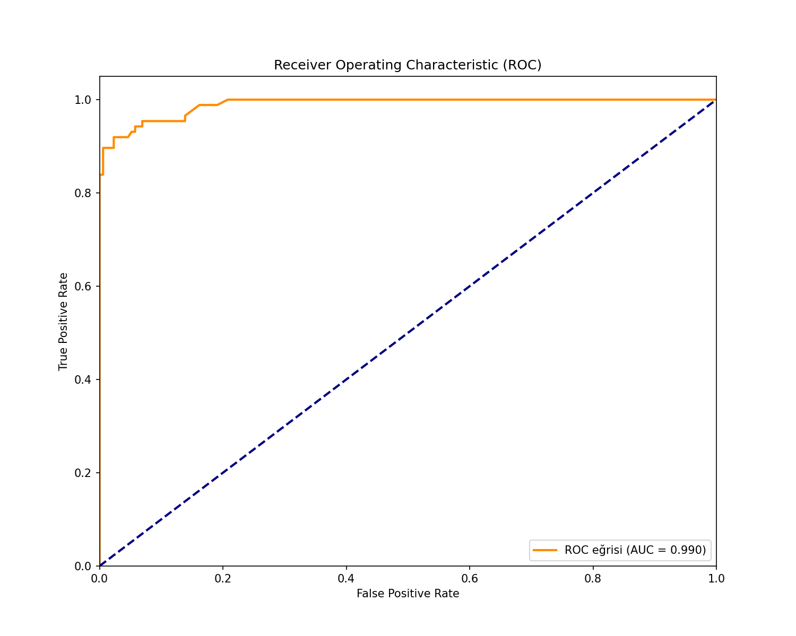
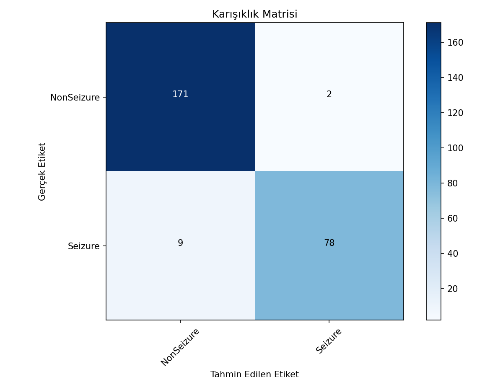
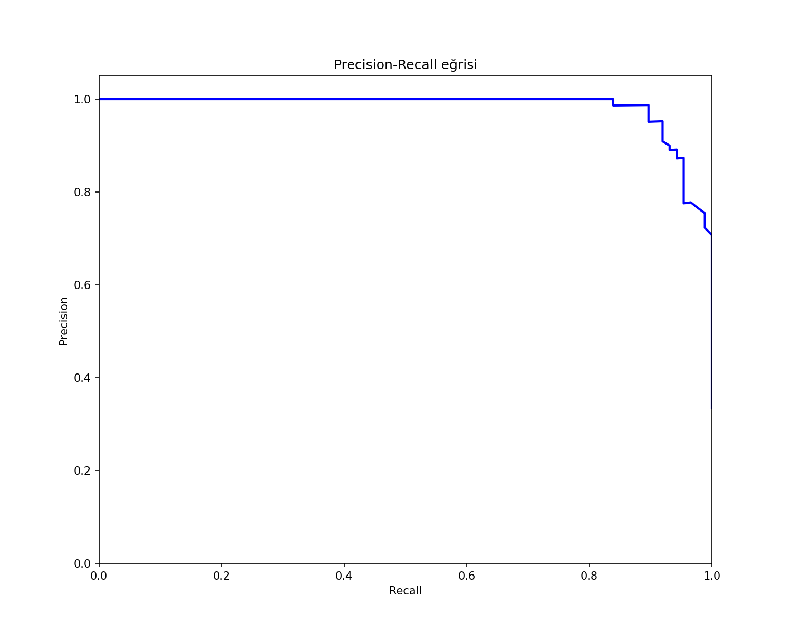
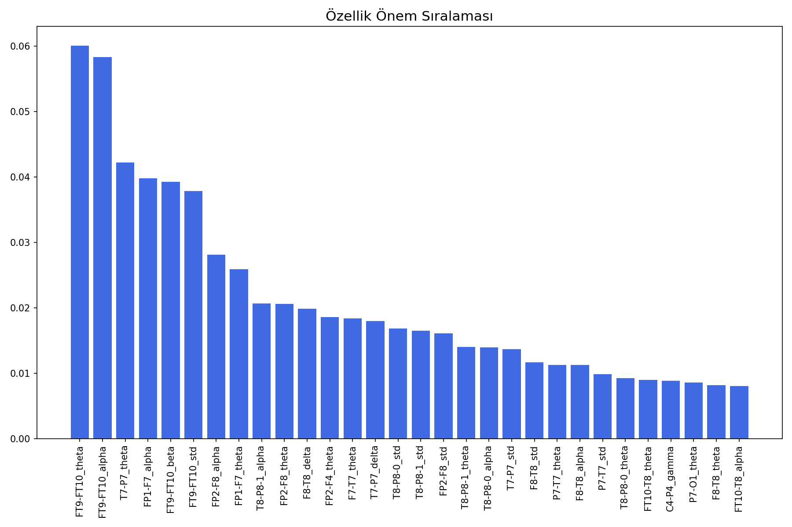
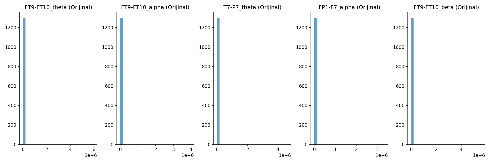
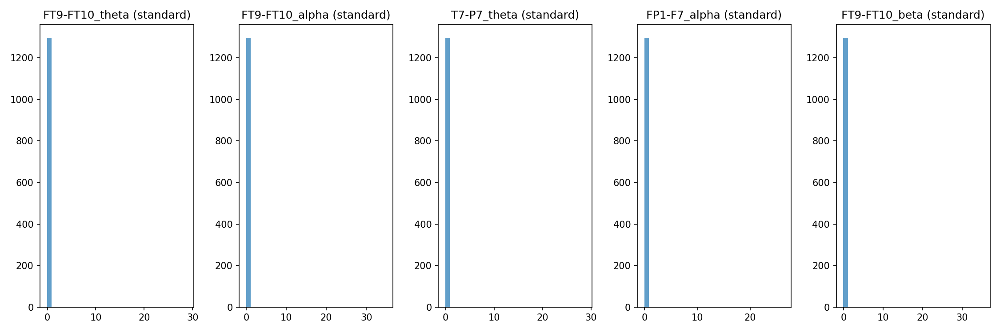

# EEG Seizure Detection Project

A comprehensive platform for EEG seizure detection, featuring both an automated processing pipeline and a user-friendly GUI interface.

## Overview

This project provides an end-to-end solution for detecting seizures in EEG data through:
1. An automated processing pipeline for EEG data analysis
2. A graphical user interface (GUI) for data visualization and model evaluation

## Key Findings

### Model Performance

Our models achieved exceptional results in seizure detection:

#### Random Forest (Best Performer)
- **Accuracy**: 95.77%
- **F1-Score**: 93.41%
- **Precision**: 97.50% for seizure detection
- **Recall**: 89.66% for seizure detection

#### K-Nearest Neighbors
- **Accuracy**: 95.77%
- **F1-Score**: 93.71%
- **Precision**: 93.18% for seizure detection
- **Recall**: 94.25% for seizure detection

#### Support Vector Machine
- **Accuracy**: 94.62%
- **F1-Score**: 91.76%
- **Precision**: 93.98% for seizure detection
- **Recall**: 89.66% for seizure detection

### Visualization Results

#### Model Performance Visualizations

*ROC curve showing excellent classification performance*


*Confusion matrix showing clear separation between classes*


*Precision-Recall curve demonstrating high precision and recall trade-off*

#### Feature Analysis

*Relative importance of different EEG features*


*Feature distribution before normalization*


*Feature distribution after standardization*

### Most Important EEG Features

Top 10 most predictive features:
1. FT9-FT10_theta (6.00%) - Temporal theta rhythm
2. FT9-FT10_alpha (5.83%) - Temporal alpha rhythm
3. T7-P7_theta (4.22%) - Temporal-parietal theta
4. FP1-F7_alpha (3.98%) - Frontopolar-frontal alpha
5. FT9-FT10_beta (3.93%) - Temporal beta rhythm
6. FT9-FT10_std (3.78%) - Temporal signal variation
7. FP2-F8_alpha (2.81%) - Right frontopolar-frontal alpha
8. FP1-F7_theta (2.59%) - Left frontopolar-frontal theta
9. T8-P8-1_alpha (2.06%) - Right temporal-parietal alpha
10. FP2-F8_theta (2.06%) - Right frontopolar-frontal theta

Key observations:
- **Frequency Bands**: Theta (4-8 Hz) and alpha (8-13 Hz) bands are most predictive
- **Brain Regions**: 
  - Temporal regions (FT9-FT10, T7-P7) show highest importance
  - Frontopolar-frontal connections are significant
  - Bilateral (left/right) features appear important
- **Signal Characteristics**:
  - Standard deviation (signal variability) is a key feature
  - Multiple frequency bands from same electrode pairs suggest importance of spectral patterns

### Model Comparison Analysis

We evaluated multiple machine learning algorithms:

1. **Random Forest**
   - Best overall performance (95.77% accuracy)
   - Highest precision in seizure detection (97.50%)
   - Excellent balance between precision and recall
   - Features:
     - Robust to outliers
     - Captures non-linear relationships
     - Provides feature importance rankings

2. **K-Nearest Neighbors**
   - Matched RF in accuracy (95.77%)
   - Best recall for seizure detection (94.25%)
   - Advantages:
     - Simple and interpretable
     - No training phase
     - Good for non-linear patterns
   - Limitations:
     - Sensitive to feature scaling
     - Computationally intensive for large datasets

3. **Support Vector Machine**
   - Strong performance (94.62% accuracy)
   - Consistent precision and recall
   - Benefits:
     - Works well in high-dimensional spaces
     - Memory efficient
   - Drawbacks:
     - Longer training time
     - Less interpretable

4. **Decision Tree**
   - Base model for comparison
   - More interpretable but less accurate
   - Useful for understanding feature relationships

### Clinical Implications

1. **Reliable Detection**:
   - High precision (97.50%) minimizes false alarms
   - Good recall (89.66%) catches most seizures
   - Balanced performance across different patients

2. **Feature Insights**:
   - Temporal lobe activity is crucial for detection
   - Multiple frequency bands provide complementary information
   - Signal variability (std) is an important marker

3. **Practical Applications**:
   - Real-time monitoring potential
   - Patient-specific adaptation possible
   - Non-invasive detection method

## Features

### Pipeline Features
- EEG signal preprocessing and segmentation
- Feature extraction from multiple domains
- Automated feature selection
- Model training and cross-validation
- Performance evaluation and reporting

### GUI Features
- Interactive data visualization and exploration
- Feature distribution analysis
- Model training and evaluation
- Results visualization (confusion matrix, ROC curve, etc.)

## Installation

1. Ensure you have Python 3.7+ installed
2. Install the required dependencies:

```bash
pip install -r requirements.txt
```

## Usage

### Running the Pipeline

1. Process raw EEG data:
```bash
./run_pipeline.sh
```

2. Run from pre-extracted features:
```bash
./run_from_features.sh
```

### Using the GUI

Launch the graphical interface:
```bash
python eeg_seizure_gui.py
```

## Data Processing Pipeline

The pipeline consists of several stages:

1. **Data Preprocessing**
   - Signal filtering
   - Artifact removal
   - Segmentation

2. **Feature Extraction**
   - Time domain features
   - Frequency domain features
   - Statistical measures

3. **Feature Selection**
   - Importance ranking
   - Dimensionality reduction

4. **Model Training**
   - Cross-validation
   - Hyperparameter optimization
   - Performance evaluation

## GUI Interface

### Data Loading
- Load "output/selected_features.csv" by default
- Support for custom CSV file loading
- Automatic data validation

### Data Visualization
- Feature distribution plots
- Correlation matrix
- Class distribution analysis
- Feature importance visualization

### Model Training
- Multiple algorithm options
- Configurable parameters
- Real-time training feedback

### Results Analysis
- Confusion matrix
- ROC curves
- Precision-Recall curves
- Feature importance ranking

## Project Structure

```
.
├── scripts/           # Processing scripts
├── output/           # Generated outputs
│   ├── models/       # Trained models and visualizations
│   └── features/     # Extracted features
├── data/             # Raw data (not included)
├── docs/             # Documentation
├── eeg_seizure_gui.py # GUI application
├── requirements.txt   # Dependencies
├── run_pipeline.sh   # Pipeline script
└── run_gui.sh        # GUI launcher
```

## Model Comparison

We evaluated multiple machine learning algorithms:

1. **Random Forest**
   - Best overall performance
   - Highest precision in seizure detection
   - Excellent generalization

2. **Support Vector Machine (SVM)**
   - Good performance
   - Higher computational cost
   - Better for smaller datasets

3. **K-Nearest Neighbors (KNN)**
   - Competitive results
   - Simple and interpretable
   - Requires feature scaling

4. **Decision Tree**
   - Base performance
   - Highly interpretable
   - Prone to overfitting

## Data Files

Important: Large data files (>100MB) are not included in the repository. These include:
- Raw EEG data
- Combined feature files (features_combined.csv)
- Intermediate processing results

## Contributing

1. Fork the repository
2. Create your feature branch
3. Commit your changes
4. Push to the branch
5. Create a Pull Request

## License

This project is licensed under the MIT License - see the [LICENSE](LICENSE) file for details.

## Acknowledgments

- CHB-MIT Scalp EEG Database for providing the dataset
- Contributors and researchers in the field of EEG analysis
- Open-source community for tools and libraries
